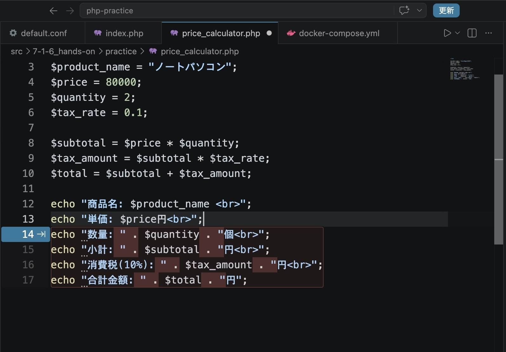
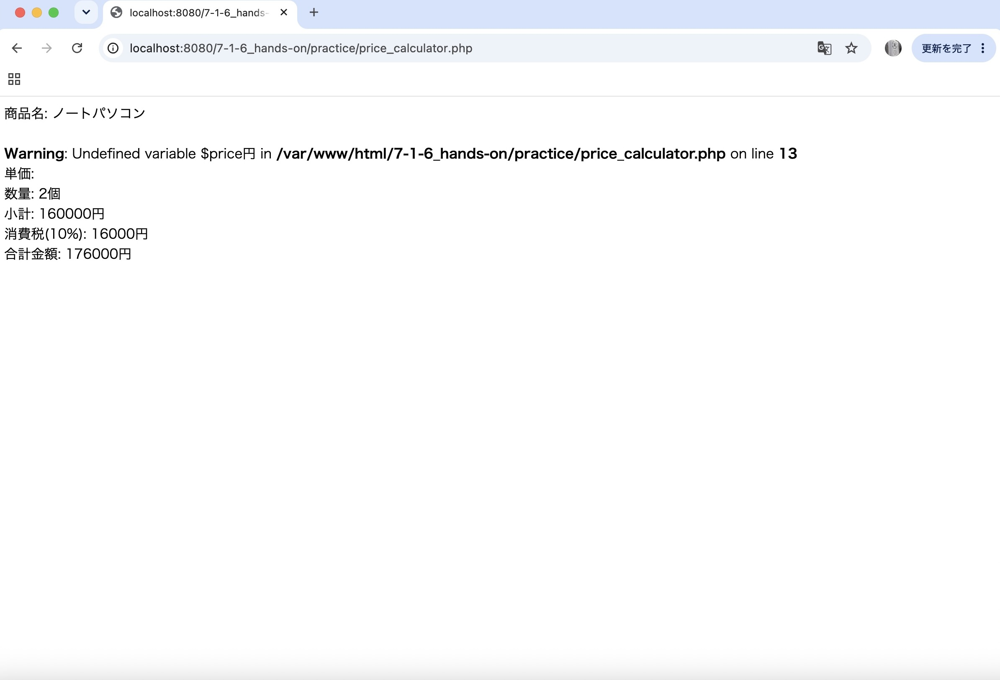

# php-basics-practice

## 概要

COACHTECH 教材 Tutorial 7-1「PHPの基礎 ハンズオン演習」で作成した成果物です。
オンラインショップの商品価格を計算するためのPHPプログラムを作成しました。
商品名、単価、数量をもとに計算し、小計、消費税、合計金額を表示します。

## 使用技術

- PHP 8.2.32
- Docker
- VScode
- HTML

## 学んだこと

- 文字列と変数を連結する方法や、PHPが変数名をどのように認識しているのかについて理解を深めた。
- わからないことがあったときは、教材を振り返って仮説を立てた上で調べたり、AIと対話しながら考えたりすることで、仕組みを理解しながら学習を進めることの大切さを改めて実感した。

## 動作確認

- リポジトリをダウンロードします。
- `price_calculator.php` ファイルをブラウザで開きます。
- 商品名、単価、数量、小計、消費税、合計金額が正しく表示されることを確認してください。

## 学習ログ

### 困ったこと

単価を表示するために、
`echo "単価: $price 円 ";`
と記述したところ、`80000 円` のように「円」の前に不要なスペースが表示されました。
そこで、スペースをなくすために、
`echo "単価: $price円 ";`
と修正しましたが、エラーが発生しました。

教材を見返し、文字列と変数を`.`で連結する方法を見つけたため、`echo "単価: " . $price . "円 ";`と修正したところ、不要なスペースがなくなり、正常に表示できました。

その後、ChatGPTに修正内容を報告した際に、`.`を使用せずに `$price円`と続けて書く方法でも表示できるという説明を受けました。しかし、実際にもう一度試すと、`Undefined variable $price円`というエラーが表示されました。

### エラーが発生したコード

### エラーメッセージが表示された画面

### 解決方法

エラーメッセージに `$price円` と表示されていたことから、PHPが `$price` をうまく処理できず、後ろの「円」まで変数名として認識しているのではないかと考え、ChatGPTに相談しました。

確認した結果、PHPは、
`$price円`
全体を一つの変数名として解釈していました。`$price円` という変数は定義していないため、`Undefined variable`のエラーが発生していたことがわかりました。

### 学んだこと

PHPでは、日本語を含む文字が変数名の一部として解釈される場合があるため、文字列の中で変数と後ろの文字を続けて書くときは、変数名の区切りを明確にする必要があると学びました。

また、説明を聞いて理解したつもりになるのではなく、実際にコードを打って動作を確かめたことで、説明の誤りに気づくことができました。エラーメッセージの内容から原因を予想し、仕組みまで確認することの大切さも学びました。
